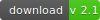

# Linebar.js

 [][1]

### Description

Solution wich allows the users control range of values

### Settings

| setting  |  attribute     |  description                                           | default | 
|----------|:---------------|--------------------------------------------------------|:-------:|
| min      | data-min       | defines minimal value to the range                     | 0       |
| max      | data-max       | defines maximal value to the range                     | 100     |
| from     | data-from      | defines left border to the start range                 | 0       |
| to       | data-to        | defines right border to the start range                | 100     |
| radius   | data-radius    | defines radius to the carriages                        | 10      |
| interact | data-interact  | enables interaction of the carriages                   | true    |
| step     | data-step      | enables the step mode of move                          | 0       |
| fields   | data-fields    | shows the input fields and the apply button            | true    |
| width    | data-width     | defines width to the main wrapper                      | 100%    |
| onChange | data-on-change | function wich trigged when change the range            | none    |
| onClick  | data-on-click  | function wich trigged when click the apply button      | none    |
| onReady  | data-on-ready  | function wich trigged when initialize the script       | none    |

### How to use

1. **create div** element with attribute **data-linebar** and define **options as data-** attributes
2. or create div element with special class for **using javaScript notation**
3. **connect linebar.min.js** after the created "div" element or before "body" closing tag
4. following connect common page script and **use linebar API**

### API

You can affect individual elements or groups of them using the special API.
Exist two ways to get the API object - by using the jquery "linebar" method or directly as an argument of the "onReady" callback function.  
For example:

```js
	// using jquery linebar function
	$.linebar(query).setState({ from : 1000 });

	// or get when it ready to use
	$('#some_id').linebar({
		onReady : function(e){
			e.setState({ to : 5000 });
		}
	});
```

linebar API provide methods:

- **setState({ from, to })** - set state to the linebar
- **getState()** - returns current state of the linebar

### Examples

```html
	<div data-linebar
		data-min="0"
		data-max="20000"
		data-from="5000"
		data-to="15000"
		data-step="3000"
		data-on-change="console.log(e)"
	></div>
	<script src="js/linebar/linebar.min.js"></script>
	<script src="js/common.js"></script>
```

```js
	$('.someclass').linebar({
		min  : 0,
		max  : 20000,
		from : 5000,
		to   : 15000,
		step : 2000,
		onClick : function(e){
			// code ...
		},
		onChange : function(e){
			// code ...
		}
	});
```

### Result


-------------
Thank's for using.  
Developed by Ustinov Maxim - [ewclide][2]

[1]: https://github.com/ewclide/linebar/archive/v2.zip  "download"
[2]: https://vk.com/ewclide  "ewclide"